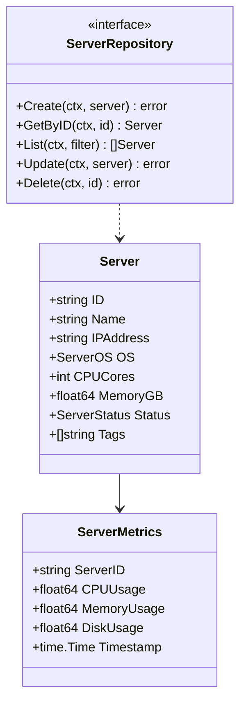
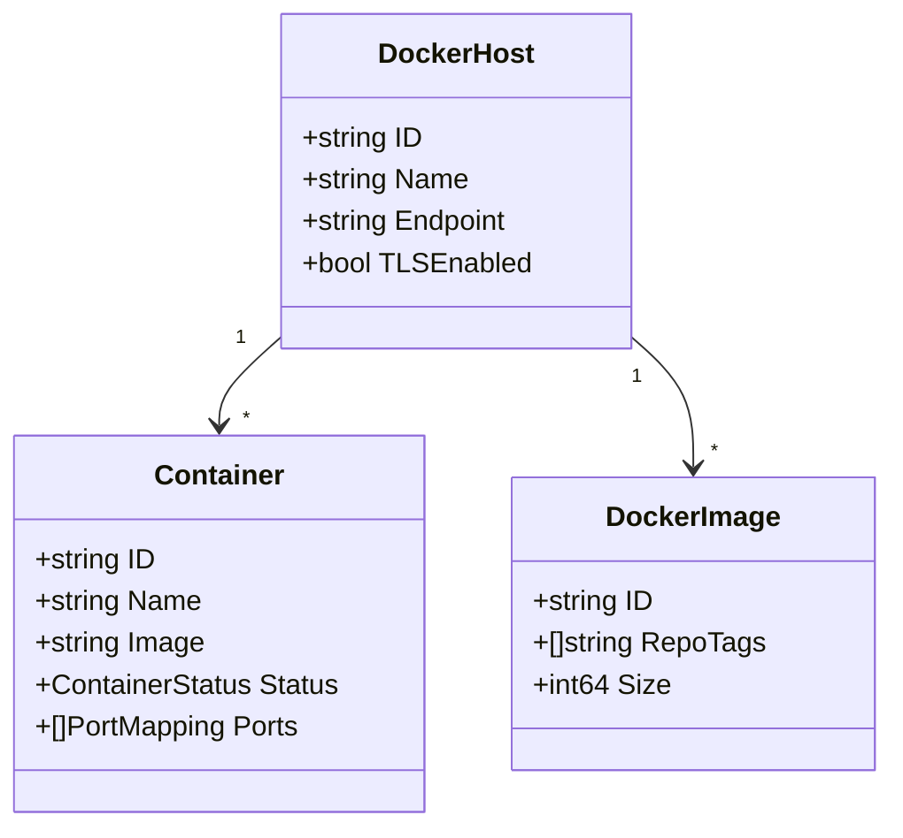
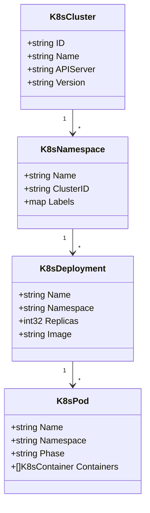
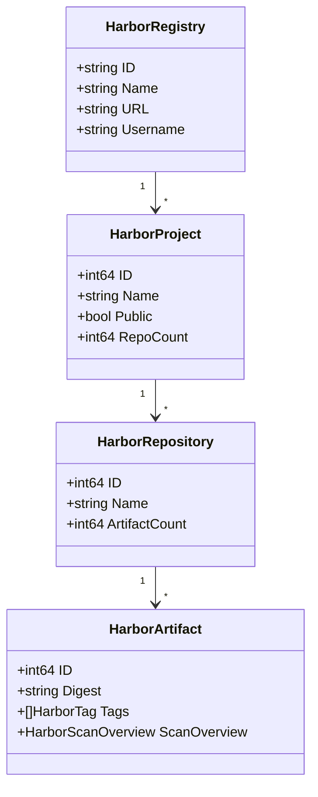
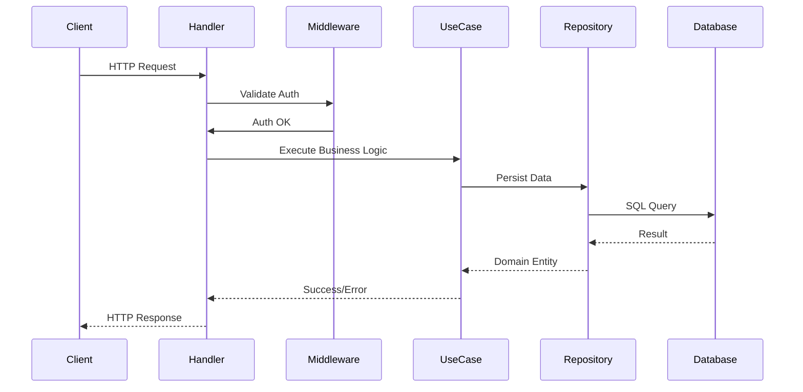
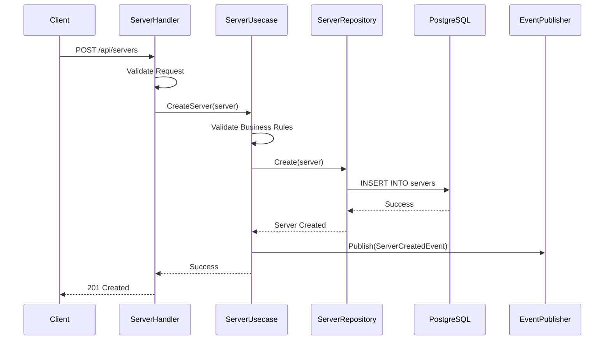
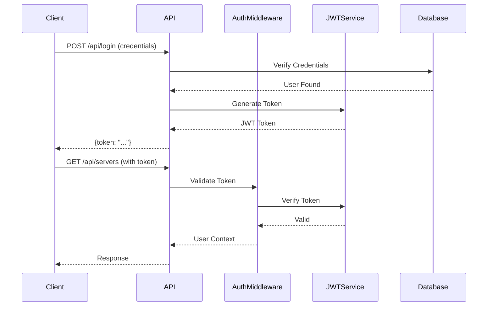
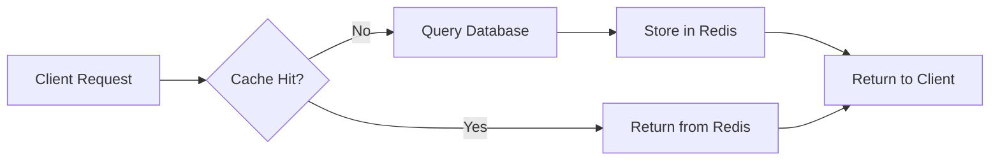
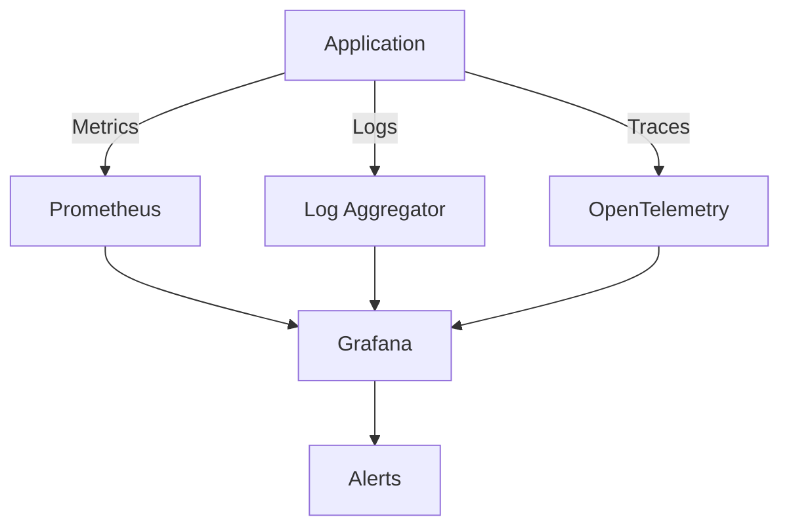

# EINFRA CRM Backend - Architecture Documentation

## Table of Contents

1. [Overview](#overview)
2. [Architecture Principles](#architecture-principles)
3. [Layer Architecture](#layer-architecture)
4. [Domain Models](#domain-models)
5. [Data Flow](#data-flow)
6. [Infrastructure Integration](#infrastructure-integration)
7. [Security Architecture](#security-architecture)
8. [Scalability & Performance](#scalability--performance)

## Overview

EINFRA CRM Backend is built using **Clean Architecture** (also known as Hexagonal Architecture or Ports and Adapters). This architectural pattern ensures:

- **Independence from frameworks**: Business logic doesn't depend on external libraries
- **Testability**: Business rules can be tested without UI, database, or external services
- **Independence from UI**: The UI can change without affecting business rules
- **Independence from database**: Business rules are not bound to the database
- **Independence from external agencies**: Business rules don't know about the outside world

## Architecture Principles

### 1. Dependency Rule

Dependencies point inward. Source code dependencies can only point inward toward higher-level policies.

```
External Interfaces → Adapters → Use Cases → Entities
```

### 2. Separation of Concerns

Each layer has a specific responsibility and doesn't know about the implementation details of other layers.

### 3. Interface Segregation

Interfaces are defined in the domain layer, and implementations are in the infrastructure layer.

### 4. Single Responsibility

Each module, class, and function has one reason to change.

## Layer Architecture

### 1. Domain Layer (`internal/domain/`)

**Responsibility**: Core business entities and rules

**Contains**:
- Entity definitions (Server, Docker, Kubernetes, Harbor)
- Repository interfaces
- Use case interfaces
- Business rules and validations
- Domain events

**Dependencies**: None (pure Go)

**Example**:
```go
// internal/domain/server.go
type Server struct {
    ID       string
    Name     string
    IPAddress string
    Status   ServerStatus
    // ... other fields
}

type ServerRepository interface {
    Create(ctx context.Context, server *Server) error
    GetByID(ctx context.Context, id string) (*Server, error)
    // ... other methods
}

type ServerUsecase interface {
    CreateServer(ctx context.Context, server *Server) error
    GetServerMetrics(ctx context.Context, serverID string) (*ServerMetrics, error)
    // ... other methods
}
```

### 2. Use Case Layer (`internal/usecase/`)

**Responsibility**: Application business logic and orchestration

**Contains**:
- Use case implementations
- Business workflow orchestration
- Transaction management
- Error handling and logging

**Dependencies**: Domain layer only

**Example**:
```go
// internal/usecase/server_usecase.go
type serverUsecase struct {
    serverRepo domain.ServerRepository
    logger     Logger
}

func (u *serverUsecase) CreateServer(ctx context.Context, server *domain.Server) error {
    // Validate business rules
    if err := u.validateServer(server); err != nil {
        return err
    }
    
    // Orchestrate the creation
    if err := u.serverRepo.Create(ctx, server); err != nil {
        u.logger.Error("Failed to create server", err)
        return err
    }
    
    // Emit domain event
    u.eventPublisher.Publish(ServerCreatedEvent{ServerID: server.ID})
    
    return nil
}
```

### 3. Infrastructure Layer (`internal/infrastructure/`)

**Responsibility**: External integrations and data persistence

**Contains**:
- Repository implementations (PostgreSQL, Redis)
- External API clients (Docker, Kubernetes, Harbor)
- Message queue producers/consumers
- File storage implementations

**Dependencies**: Domain layer (implements interfaces)

**Example**:
```go
// internal/infrastructure/repository/postgres_server_repository.go
type postgresServerRepository struct {
    db *gorm.DB
}

func (r *postgresServerRepository) Create(ctx context.Context, server *domain.Server) error {
    return r.db.WithContext(ctx).Create(server).Error
}

// internal/infrastructure/docker_client.go
type dockerClient struct {
    client *docker.Client
    config config.DockerConfig
}

func (c *dockerClient) ListContainers(ctx context.Context, hostID string) ([]*domain.Container, error) {
    // Implementation using Docker SDK
}
```

### 4. Adapter Layer (`internal/adapter/`)

**Responsibility**: HTTP API and external communication

**Contains**:
- HTTP handlers
- Request/Response DTOs
- Middleware
- Route definitions

**Dependencies**: Domain and Use Case layers

**Example**:
```go
// internal/adapter/http/handler/server_handler.go
type ServerHandler struct {
    serverUsecase domain.ServerUsecase
}

// CreateServer godoc
// @Summary Create a new server
// @Description Create a new server with the provided information
// @Tags servers
// @Accept json
// @Produce json
// @Param server body dto.CreateServerRequest true "Server information"
// @Success 201 {object} dto.ServerResponse
// @Failure 400 {object} dto.ErrorResponse
// @Router /servers [post]
// @Security BearerAuth
func (h *ServerHandler) CreateServer(c *gin.Context) {
    var req dto.CreateServerRequest
    if err := c.ShouldBindJSON(&req); err != nil {
        c.JSON(400, dto.ErrorResponse{Error: err.Error()})
        return
    }
    
    server := req.ToDomain()
    if err := h.serverUsecase.CreateServer(c.Request.Context(), server); err != nil {
        c.JSON(500, dto.ErrorResponse{Error: err.Error()})
        return
    }
    
    c.JSON(201, dto.ToServerResponse(server))
}
```

## Domain Models

### Server Management



### Docker Management



### Kubernetes Management



### Harbor Management



## Data Flow

### Request Flow



### Example: Create Server Flow



## Infrastructure Integration

### Docker Integration

The system integrates with Docker using the official Docker SDK:

```go
// Connection Management
client, err := docker.NewClientWithOpts(
    docker.WithHost(cfg.Infrastructure.Docker.DefaultHost),
    docker.WithAPIVersionNegotiation(),
)

// Container Operations
containers, err := client.ContainerList(ctx, types.ContainerListOptions{})
```

### Kubernetes Integration

Integration with Kubernetes uses client-go:

```go
// Client Creation
config, err := clientcmd.BuildConfigFromFlags("", kubeconfig)
clientset, err := kubernetes.NewForConfig(config)

// Resource Operations
pods, err := clientset.CoreV1().Pods(namespace).List(ctx, metav1.ListOptions{})
```

### Harbor Integration

Harbor integration uses REST API:

```go
// Client Configuration
client := &http.Client{
    Timeout: time.Duration(cfg.Infrastructure.Harbor.RequestTimeout) * time.Second,
}

// API Calls
req, _ := http.NewRequest("GET", harborURL+"/api/v2.0/projects", nil)
req.SetBasicAuth(username, password)
resp, err := client.Do(req)
```

## Security Architecture

### Authentication Flow



### Authorization

- **JWT Tokens**: Stateless authentication
- **RBAC**: Role-based access control
- **Middleware**: Permission checking per route
- **Audit Logging**: All actions are logged

### Security Measures

1. **Input Validation**: All inputs validated using go-playground/validator
2. **SQL Injection Prevention**: GORM ORM with parameterized queries
3. **XSS Protection**: Proper output encoding
4. **CORS**: Configurable CORS policies
5. **Rate Limiting**: IP-based rate limiting
6. **TLS**: Support for TLS connections to external services

## Scalability & Performance

### Horizontal Scaling

The application is stateless and can be scaled horizontally:

```
┌─────────────┐
│ Load        │
│ Balancer    │
└──────┬──────┘
       │
   ┌───┴───┬───────┬───────┐
   │       │       │       │
┌──▼──┐ ┌──▼──┐ ┌──▼──┐ ┌──▼──┐
│ API │ │ API │ │ API │ │ API │
│  1  │ │  2  │ │  3  │ │  N  │
└──┬──┘ └──┬──┘ └──┬──┘ └──┬──┘
   │       │       │       │
   └───┬───┴───────┴───────┘
       │
┌──────▼──────┐
│  PostgreSQL │
│   Cluster   │
└─────────────┘
```

### Caching Strategy



### Performance Optimizations

1. **Connection Pooling**: Database connection pooling with configurable limits
2. **Redis Caching**: Frequently accessed data cached in Redis
3. **Pagination**: All list endpoints support pagination
4. **Lazy Loading**: Related entities loaded on demand
5. **Indexing**: Proper database indexes on frequently queried fields
6. **Async Operations**: Long-running operations handled asynchronously

### Monitoring



## Deployment Architecture

### Development Environment

```
Developer Machine
├── Go Application (localhost:8080)
├── PostgreSQL (localhost:5432)
├── Redis (localhost:6379)
├── Docker Daemon (unix:///var/run/docker.sock)
└── Kubernetes (minikube/kind)
```

### Production Environment

```
Cloud Infrastructure
├── Kubernetes Cluster
│   ├── API Pods (3+ replicas)
│   ├── Ingress Controller
│   └── Service Mesh (optional)
├── Managed PostgreSQL (RDS/Cloud SQL)
├── Managed Redis (ElastiCache/Memorystore)
├── Object Storage (S3/GCS)
└── Monitoring Stack
    ├── Prometheus
    ├── Grafana
    └── Alert Manager
```

## Conclusion

This architecture provides:

- ✅ **Maintainability**: Clear separation of concerns
- ✅ **Testability**: Easy to unit test business logic
- ✅ **Flexibility**: Easy to swap implementations
- ✅ **Scalability**: Horizontal scaling support
- ✅ **Security**: Multiple layers of security
- ✅ **Performance**: Optimized for high throughput

The Clean Architecture approach ensures the codebase remains maintainable and extensible as the application grows.
